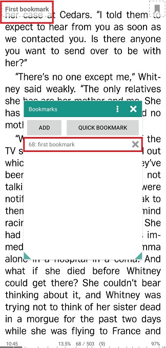

# Arbeiten mit Lesezeichen im erweiterten Modus (Lesezeichenleiste)

> Sie können **Librera** Ihre Lesezeichen jederzeit auf dem Bildschirm anzeigen lassen, während Sie ein Buch lesen. Sie werden am oberen Bildschirmrand in einem sogenannten _Bookmarks Ribbon_ angezeigt. Dieser erweiterte Lesezeichenmodus sollte sich als praktisch erweisen, wenn Sie neue Lesezeichen hinzufügen oder blitzschnell zwischen ihnen wechseln müssen.
> Wir erwarten, dass dieses coole Feature bei Musikern sehr gefragt ist, während die App im _Musiker-Modus_ ausgeführt wird. Daher ist die Multifunktionsleiste standardmäßig in diesem Modus aktiviert.

So aktivieren Sie es in den anderen Modi:

* Tippen Sie auf das Symbol _Einstellungen_, um das Fenster **Einstellungen** zu öffnen
* Tippen Sie auf den Tab _Statusleiste_
* Aktivieren Sie im Bereich &quot;Lesezeichen-Multifunktionsleiste&quot; das Kontrollkästchen neben dem Modus, für den Sie die Multifunktionsleiste aktivieren möchten.

||||
|-|-|-|
||||

Vorgänge mit der _Bookmarks-Multifunktionsleiste_ werden im _Book_-Modus veranschaulicht. Für alle drei Modi funktioniert alles gleich.

> Wenn Sie das _Bookmark Ribbon_ nicht mehr benötigen, können Sie es deaktivieren, indem Sie das entsprechende Kontrollkästchen auf der Registerkarte _Statusleiste_ deaktivieren.

||||
|-|-|-|
||||

**Hinzufügen von Lesezeichen**

> Der Lesezeichen-Floater in der oberen rechten Ecke zeigt an, dass Sie sich derzeit im _Bookmarks Ribbon_-Modus befinden.

* Tippen Sie auf der Seite, für die Sie ein Lesezeichen erstellen möchten, auf den Lesezeichen-Floater
* Tippen Sie auf _ADD_, um das Lesezeichen über das Fenster _Bookmarks_ hinzuzufügen
* Kommentieren Sie das Lesezeichen. Beachten Sie, dass der Name des Lesezeichens aus Ihrem Kommentar stammt (**erstes Lesezeichen** in unserem Beispiel).
* Tippen Sie auf **HINZUFÜGEN**, um den Vorgang abzuschließen.

||||
|-|-|-|
||||

Ihr neues Lesezeichen wird im Fenster &quot;Lesezeichen&quot; angezeigt, und gleichzeitig wird es oben in der Multifunktionsleiste &quot;Lesezeichen&quot; angezeigt. Um zu diesem Lesezeichen zurückzukehren, müssen Sie es nur in der Multifunktionsleiste antippen.

> Hinweis: Durch langes Drücken auf ein Lesezeichen in der Multifunktionsleiste wird ein Bearbeitungsfenster geöffnet.
* Speichern Sie Ihre Bearbeitungsergebnisse, indem Sie auf **SPEICHERN** tippen.
* Sie können das Lesezeichen auch löschen, indem Sie auf **LÖSCHEN** tippen.

Die Multifunktionsleiste wird zu einer vollständigen Multifunktionsleiste auf Ihrem Bildschirm, wenn Sie viele Lesezeichen haben. Sie können durch Wischen mit dem Finger durch sie navigieren.

||||
|-|-|-|
||||

**Hinzufügen von Schnelllesezeichen**

* Tippen Sie oben rechts auf den Lesezeichen-Floater, um das Fenster &quot;Lesezeichen&quot; zu öffnen.
* Tippen Sie auf **SCHNELLES LESEZEICHEN**.
* Auf diese Weise wird ein &quot;Schnelllesezeichen&quot; erstellt, das durch die Seitenzahl in der Multifunktionsleiste oben angegeben wird. In der Liste im Fenster &quot;Lesezeichen&quot; werden die Seite # und das _Schnelle Lesezeichen_ daneben angezeigt.
> Sie können ein schnelles Lesezeichen in der Liste lange drücken, um es in einem Popup-Fenster zum Bearbeiten von Lesezeichen zu bearbeiten oder zu löschen.

||||
|-|-|-|
||||

> Sie können einige Vorgänge umgehen, wenn Sie Lesezeichen hinzufügen oder löschen, indem Sie das _Bookmarks Ribbon_ verwenden:

* Ein langer Druck auf den Lesezeichen-Floater in der oberen rechten Ecke fügt ein schnelles Lesezeichen hinzu.
* Durch langes Drücken auf ein Lesezeichen in der _Bookmarks-Multifunktionsleiste_ wird eine Eingabeaufforderung geöffnet, die Sie zum Löschen auffordert.
