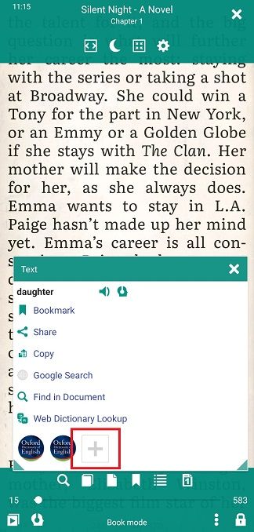

# Using Dictionaries and Translators

> When you read a book, especially in a foreign language, you may need to look up the meaning of a word you don't know in a dictionary. With **Librera**, you can do it easily, in a single click, on- and offline.

**Librera** allows you to look up a single word or translate entire passages using online translators (dictionaries).

There are plenty of **ONLINE** dictionaries and translators on the Internet. They let you check the meaning of a word without installing anything on your device.
> **Librera** will open a browser window for you with the selected word in the search field of the chosen dictionary.
 
 You can choose from the following (to name just a few):

* Lingvo
* Oxford
* Longman
* Cambridge
* Macmillan
* Collins
* Merriam-Webster
* 1tudien
* Vdict
* Wikipedia
* Wiktionary
* Academic.ru
* Vocabulary.com
* Deepl.com
* Treccani.it, etc.

**OFFLINE** dictionaries and translators need to be installed on your device from Google Play (or elsewhere). They will pop up a window with the translation or definition of a selected word, and won't need the Internet to work.

1. A list of most popular free dictionaries and translators on Google play is as follows:

* Google Translate
* Microsoft Translator
* Multitran Russian Dictionary
* Oxford Dictionary
* Yandex.Translate, etc.

2. You can also install a **dictionary-shell**, which will handle dictionaries made by third-party compilers, such as, for instance:

* GoldenDict
* Fora Dictionary, etc.
 
> **If you have not found in *Librera* the online resource you're looking for, please send your request to the developers at librera.reader@gmail.com or raise an issue on github.**

## One-Click Dictionary Lookup
To enable an immediate dictionary lookup of a selected word, you need to:
* Open the **Preferences** window by tapping the **Settings** icon
* Check the _Open selection in dictionary_ box in the main tab
* Select a word by a long-press
* If you're selecting a word sequence, you need to drag your finger. You can use the handles to specify the exact sequence.

||||
|-|-|-|
||||

## Setting Up a Default Dictionary
You can also configure your default dictionary (which will pop up right upon a word selection):
* Tap on the _Dictionary_ link next to the _Open selection_ box
* Select the dictionary you prefer from the dropdown list of dictionaries and translators (Note: the list features both online and offline dictionaries)

||||
|-|-|-|
||||

## Leaving the Selection Box Unchecked
If you leave the _Open selection_ box unchecked, you will be presented with the **Text** window upon selecting a word or word sequence. Here you will be able to:
* Look up or translate this word (sequence) in the online resource of your choosing (by tapping _Web Dictionary Lookup_)

||||
|-|-|-|
||||

* Find (by tapping the **+** sign if necessary) your preferred installed dictionary or translator
* Tap on its icon to invoke its popup window with the word translation (definition)

||||
|-|-|-|
||||

> A quick reminder: Don't forget to choose your default dictionary BEFORE checking the _Open selection in dictionary_ box.

||||
|-|-|-|
||||
