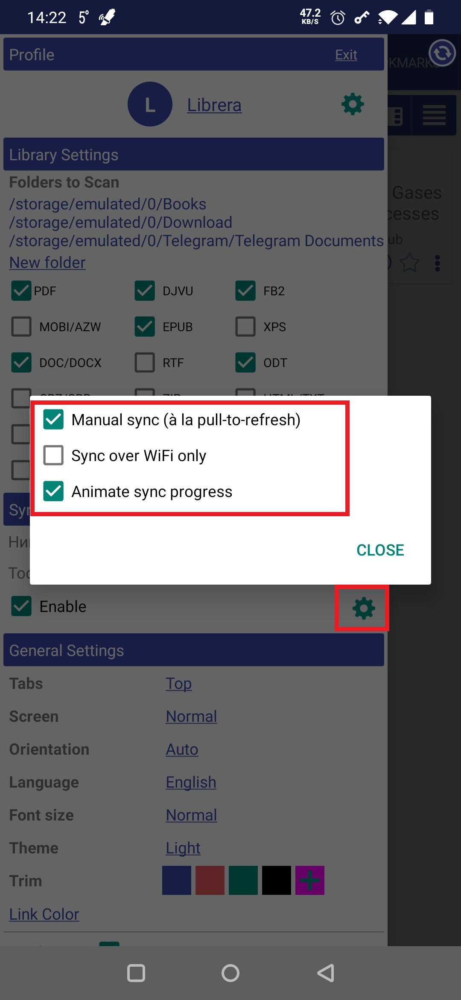
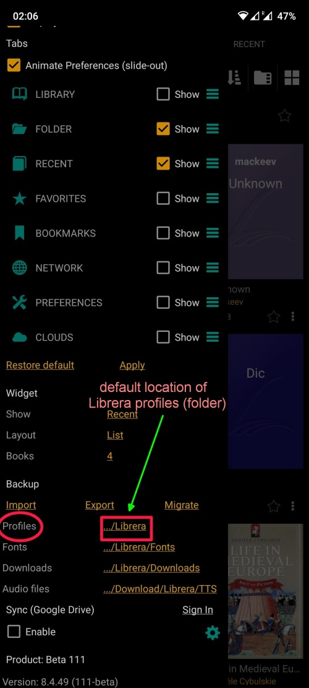

# Syncing Your Reading Setup Across Multiple Devices

> _Librera_ is equipped with a syncing tool that should come in handy in cases when users own more than one Android device and tend to alternate between them (even sporadically). Using this tool, you will be able to sync _Librera_'s profiles, reading progress, bookmarks, and your reading settings.

For the convenience of most of our users, we have chosen Google Drive as _Librera_'s synchronization hub.

* To enable syncing, go to the _Sync_ panel in the slide-out _Preferences_ tab and check the respective box
* You need to sign into your Google Drive account
 
> **To ensure proper synchronization, your other devices must be logged into the same account.**

||||
|-|-|-|
||||

## Synchronization Options

* If _Manual sync_ is checked, you will need to swipe your finger down the screen to start syncing (in Android's native pull-to-refresh fashion)
* You can prevent the syncing tool from biting into your data plan by enabling WiFi-syncing only.
* You can entertain yourself with sync-progress animation (spinning wheel) by checking this option
* To view the sync log, just tap the settings icon in the _Sync_ panel

||||
|-|-|-|
||||

> Note: Google Drive has been chosen for its convenience. Google accounts are free and available to anyone. If, for whatever reason, you prefer any other cloud solution, go ahead and use it.

## Syncing via Third-Party Apps

The reasons behind your partiality to a third-party synchronization application may vary. Although we are constantly working on fine-tuning and improving your experience with syncing via Google Drive, we do admit that it's still work-in-progress. It still operates in experimental mode and, mind you, can drop off on you all of a sudden.  
Moreover, you can encounter the famous _Google Drive Access Denial_, which is totally not _Librera_'s fault, but rather occurs due to peculiarities of your device's configuration. (You can glean more info on the issue from the Internet, easily.)  

If you do heed our work-in-progress warning and believe a third-party syncing app to be more robust (or you just don't trust Google), make sure your app:
1. Supports realtime syncing
2. Keeps synced directories locally (**NB!** 0fficial Dropbox app, for instance, does **NONE** of those!)

If both of the two prerequisites hold:  
* make it sync the **Librera** folder in your internal storage. This folder contains all your _Librera_ settings and profiles;
* or you should move this entire **Librera** folder to the folder created by your syncing app and change the path to your _Profiles_ in Librera accordingly.

(In the illustrated example below, we have:
* chosen the **Downloads** folder to impersonate your synced folder, 
* copied the **Librera** folder with all its contents there, and
* changed the path to your _Profiles_ to a new location.

||||
|-|-|-|
||||

**To ensure a seamless syncing experience, it goes without saying, obviously, that you should have the same setup across all of your Android devices.**

> **P.S.** As for the books downloaded from online resources, you can store them in folders synced via a third-party app and add those folders to _Librera_'s Library.

