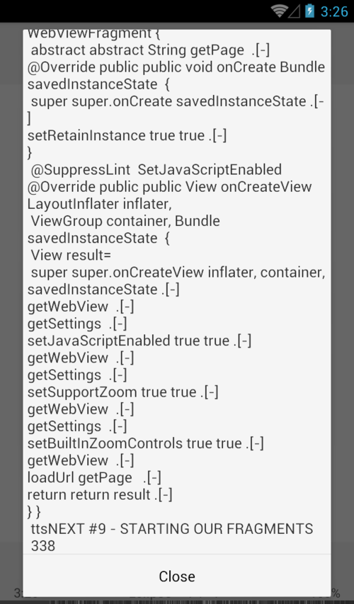

# substituições TTS

> As substituições de conversão de texto em fala são usadas para alterar a maneira como o mecanismo pronuncia certas palavras, para ignorar certos caracteres durante a leitura ou para definir marcas de tensão corretas.

* Ativar substituições TTS
* Mostre a passagem com resultados de substituição
* A caixa de diálogo **Substituições** para definir regras de substituição

|1|2|3|
|-|-|-|
||||

Substituições clássicas são suportadas (alteração direta de uma cadeia de caracteres por outra) ou você pode usar expressões regulares (RegExp).

Expressões

* &quot;texto&quot; - texto simples
* &quot;* texto&quot; - * regra RexExp
* &quot;# texto&quot; - regra desativada
* &quot;text256&quot; - regra desabilitada

## exemplos

* &quot;Lib.&quot; -&gt; &quot;Librera&quot; - substitua Lib. com Librera
* &quot;Librera&quot; -&gt; &quot;Libréra&quot; - adicione uma marca de tensão correta
* &quot;# Lib.&quot; -&gt; &quot;Librera&quot; - use &quot;#&quot; para desativar uma regra
* &quot;* (L | l) ib.&quot; -&gt; &quot;$ 1ibrera&quot; - substitua Lib. com Librera e lib. com librera
* &quot;* [()&quot; «» * ”“/[] &quot;-&gt;&quot; &quot;- ignorar caracteres
* &quot;* [?!:; - | - | -]&quot; -&gt; &quot;,&quot; - substitui chars por uma pausa (,)

## Comandos TTS

* &quot;text&quot; -&gt; ttsPAUSE - Adiciona uma pausa após &quot;text&quot;
* &quot;text&quot; -&gt; ttsSTOP - Interrompa o TTS se encontrar &quot;text&quot; na frase
* &quot;text&quot; -&gt; ttsNEXT - Vá para a próxima página se encontrar &quot;text&quot; na frase
* &quot;text&quot; -&gt; ttsSKIP - Pule a frase de leitura se encontrar &quot;text&quot; na frase

## Adicione um arquivo de regras

O** Librera** suporta arquivos de regras RegExp do **@Voice Reader**
Confira este exemplo **demo-replaces.txt** abaixo:

```
" живого " "живо́ва"
" как глаза " " как глаза́ "
" мне глаза" " мне глаза́"
" наклоняющая головы" "наклоня́ющая го́ловы"
" никакого стрелка" "никако́во стрелка́"
" ПОЖАРОБЕЗОПАСНУЮ СРЕДУ" "пожарабезопа́сную среду́."
" Стрелки!" "Стрелки́!"
" стрелки?" "стрелки́?"
", все так," ", всё так,"
"Зачем, стрелок?" "Зачем, стрело́к?"
"стрелок?" "стрело́к?"
*"(?i)\b\Q душа в душу\E\b" "душа́ в ду́шу"
*"(?i)\b\Q подогнулись\E\b" "падагну́лись"
*"(?i)\b\Q стрелки почувствовали\E\b" "стрелки́ почувствовали"
*"(?i)\b\Q стрелки продолжили\E\b" "стрелки́ продолжили"
*"(?i)\b\Q стрелку из\E\b" "стрелку́ из"
*"(?i)\b\Q стрелок\E\b" "стрело́к"
*"(?i)\b\Q стрелы\E\b" "стре́лы"
*"(?i)\b\Q*\E\b" "сно́ска"
*"(?i)\b\Q1 курса\E\b" "1-го курса"
*"(?i)\b\Q171 группы\E\b" "171-ой группы"
*"(?i)\b\Q1977\E\b" "1977-ой"
*"(?i)\b\QAcapela\E\b" "Акапэ́'ла"
*"(?i)\b\QBIOS\E\b" "БИ́“О́С"

*"(^| )(Д|д)-р" " доктор"
"(^| )(Г|г)-н" " господин"
*"(\d+)\s?-\s?я\b(?# ""я"" на границе слова)" "$1-я "
```
## Ignorar áreas cortadas em documentos PDF
> Muitas vezes, as páginas em arquivos PDF (livros, artigos de periódicos, livros didáticos etc.) têm cabeçalhos e rodapés que são executados em todo o documento. Você pode cortar as cabeças de corrida com uma pitada de dois dedos, que continuará nas páginas seguintes (e anteriores). Mas seu mecanismo TTS não tem idéia sobre suas manipulações. Portanto, você precisa dizer o que fazer (ignore a coisa chata!) Enquanto lê o documento em voz alta para você.

No **Librera**, introduzimos substituições (comandos) especiais que permitem ignorar as áreas cortadas e garantir uma leitura contínua e ininterrupta.
* Na janela **Substituições**, insira uma palavra ou sequência de palavras na coluna esquerda e _ttsSKIP_ como sua substituição. Esta substituição informará o mecanismo para pular a frase com esta sequência de palavras/palavras
* Digite uma palavra ou sequência de palavras na coluna esquerda e _ttsNEXT_ como substituto. A substituição informará o mecanismo para pular a frase com esta sequência de palavras/palavras e ir imediatamente para a próxima página
* Não se esqueça de pressionar _APPLY_ para deixar as substituições

|4|5|
|-|-|
|||

> **Teste suas alterações algumas vezes para garantir que tudo esteja funcionando como deveria!**

## Leia a abreviatura como ela é

Às vezes, a abreviatura TTS é lida incorretamente, podemos ajudá-la a ser lida como está.
```
"*(\w). (\p{javaLowerCase})" "$1 $2"
```
