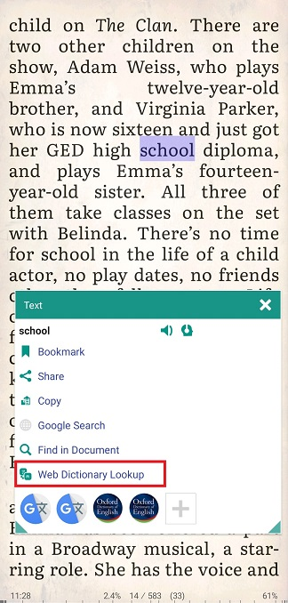
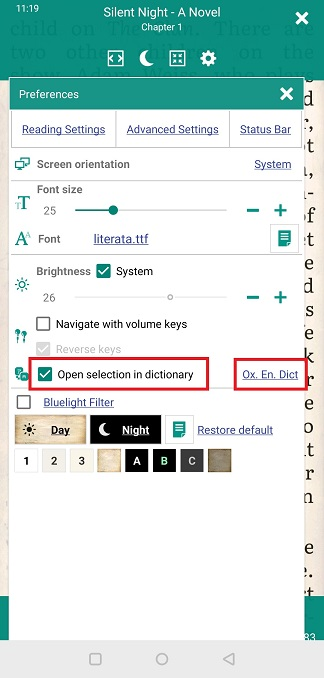

# Wörterbücher, Übersetzung von Wörtern und Sätzen

> Wenn Sie Bücher lesen, müssen Sie möglicherweise die Bedeutung eines Wortes nachschlagen, das Sie in einem Wörterbuch nicht kennen. Mit Librera können Sie mit vielen Wörterbüchern arbeiten und Informationen zu Wörtern mit einem Klick abrufen.

Librera unterstützt Online- (Web) und Offline-Wörterbücher (Anwendungen).

**Online** - ohne das Wörterbuch auf Ihr Mobilgerät herunterzuladen, wenn Sie Zugang zum Internet haben. Informationen zur Bedeutung Ihres Wortes werden im Internetbrowser angezeigt.

Zum Beispiel:

* Lingvo
* Oxford
* Longman
* Cambridge
* Macmillan
* Collins
* Merriam-Webster
* 1tudien
* Vdict
* Wikipedia
* Wiktionary
* Academic.ru
* Vocabulary.com
* Deepl.com
* Treccani.it

**Offline** - Wenn das Wörterbuch aus dem Google Play Store auf Ihr Mobilgerät heruntergeladen wird, werden die Informationen im Wörterbuchprogramm oder in dessen Popup-Fenster angezeigt.

Zum Beispiel:

* Google Translate
* Microsoft Translator
* Multitran-Wörterbuch
* Oxford-Wörterbuch

Wenn Sie das erforderliche Wörterbuch nicht gefunden haben, können Sie einen Vorschlag senden, um es der Mail librera.reader@gmail.com hinzuzufügen, oder ein Problem bei github melden.

||||
|-|-|-|
||||

Um das gewünschte Wörterbuch zu konfigurieren und auszuwählen, benötigen Sie:

* Klicken Sie auf das Einstellungssymbol
* Klicken Sie auf den Tab &quot;Erweiterte Einstellungen&quot;
* Klicken Sie auf das Referenzwörterbuch
* Wählen Sie Ihr installiertes Offline- oder Online-Wörterbuch aus der Liste aus und streichen Sie nach oben oder unten.

In diesem Beispiel werden die Offline-Wörterbücher Google Übersetzer und Oxford Dictionary of English verwendet.

||||
|-|-|-|
||||

**Arbeiten mit dem Online-Wörterbuch:**

* Tippen Sie lange auf das Wort
* Wählen Sie &quot;Web Dictionary Lookup&quot; aus.
* Wählen Sie das Wörterbuch aus, an das Sie das Wort übergeben möchten. Lassen Sie uns zum Beispiel zum Collins-Wörterbuch übergehen.

||||
|-|-|-|
||||

**Arbeiten mit dem Offline-Wörterbuch:**

* Tippen Sie lange auf das Wort
* Wählen Sie das Symbol des gewünschten Wörterbuchs aus, z. B. Oxford Dictionary of English
* Wenn Sie eine Verknüpfung zu einem anderen bereits installierten Wörterbuch hinzufügen möchten, klicken Sie auf das &quot;Plus&quot; -Symbol und wählen Sie es aus.
* Sie können die einfache Berührung konfigurieren, um das Wort zu übersetzen

||||
|-|-|-|
||||

Wenn Sie die Wörterbuchauswahl überspringen möchten, tippen Sie auf das Wort, damit der Text sofort in Ihr Wörterbuch übertragen wird:

* Aktivieren Sie das Kontrollkästchen &quot;Auswahl im Wörterbuch öffnen&quot; und wählen Sie das gewünschte Wörterbuch aus.

||||
|-|-|-|
||||
