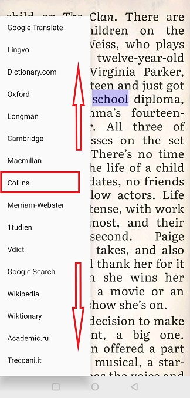

# Dictionnaires, traduction de mots et de phrases

> Lorsque vous lisez des livres, vous devrez peut-être rechercher le sens d'un mot que vous ne connaissez pas dans un dictionnaire. Librera vous permet de travailler avec de nombreux dictionnaires et d'obtenir des informations sur les mots en un clic.

Librera prend en charge les dictionnaires en ligne (Web) et hors ligne (applications).

**En ligne** - sans télécharger le dictionnaire sur votre appareil mobile, si vous avez accès à Internet. Les informations sur la signification de votre mot seront affichées dans le navigateur Internet.

Par exemple:

* Lingvo
* Oxford
* Longman
* Cambridge
* Macmillan
* Collins
* Merriam-Webster
* 1tudien
* Vdict
* Wikipedia
* Wiktionnaire
* Academic.ru
* Vocabulaire.com
* Deepl.com
* Treccani.it

**Hors connexion** - lorsque le dictionnaire est téléchargé sur Google Play Store sur votre appareil mobile, les informations s'affichent dans le programme du dictionnaire ou dans sa fenêtre contextuelle.

Par exemple:

* Google Translate
* Microsoft Translator
* Dictionnaire multitran
* dictionnaire Oxford

Si vous n'avez pas trouvé le dictionnaire nécessaire, vous pouvez envoyer une proposition pour l'ajouter au courrier librera.reader@gmail.com ou faire un problème sur github.

||||
|-|-|-|
||||

Pour configurer et sélectionner le dictionnaire dont vous avez besoin, vous avez besoin de:

* Cliquez sur l'icône des paramètres.
* Cliquez sur l'onglet &quot;Paramètres avancés&quot;.
* Cliquez sur le dictionnaire de noms de référence.
* Sélectionnez votre dictionnaire installé hors ligne ou en ligne dans la liste, faites glisser votre doigt vers le haut ou le bas.

Cet exemple utilise les dictionnaires hors ligne Google Translator et Oxford Dictionary of English.

||||
|-|-|-|
||||

**Utilisation du dictionnaire en ligne:**

* appuyez longuement sur le mot
* Sélectionnez &quot;Recherche dans le dictionnaire Web&quot;.
* Sélectionnez le dictionnaire auquel vous souhaitez transmettre le mot. Passons par exemple au dictionnaire Collins.

||||
|-|-|-|
||||

**Utilisation du dictionnaire hors ligne:**

* appuyez longuement sur le mot
* Sélectionnez l'icône du dictionnaire dont vous avez besoin, par exemple Oxford Dictionary of English.
* Si vous souhaitez ajouter un raccourci vers un autre dictionnaire déjà installé, cliquez sur l'icône &quot;plus&quot; et sélectionnez-le.
* Il est possible de configurer une seule touche pour traduire le mot.

||||
|-|-|-|
||||

Si vous souhaitez ignorer la sélection du dictionnaire, après avoir tapé sur le mot, le texte sera immédiatement transféré dans votre dictionnaire:

* Cochez la case &quot;Ouvrir la sélection dans le dictionnaire&quot; et sélectionnez le dictionnaire dont vous avez besoin.

||||
|-|-|-|
||||
