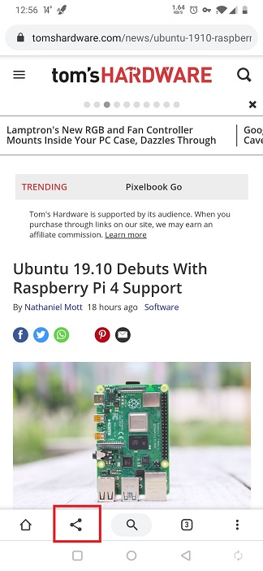

# Übertragen von Text vom Webbrowser (zum Lesen oder TTS)

> In Librera können Sie Artikel aus dem Internetbrowser sowohl nach Text als auch nach sexueller Reproduktion lesen.

 
Zum Lesen in Librera benötigen Sie:

* Öffnen Sie die gewünschte Webseite in Ihrem Browser. In diesem Beispiel wird der Standardbrowser verwendet. Sie können Ihren Browser mit der Möglichkeit verwenden, die Seite über den Browser freizugeben.

* Klicken Sie in Ihrem Internetbrowser auf das Freigabesymbol

* Wählen Sie Librera aus der Dropdown-Liste der Programme aus

* Wählen Sie aus, in welchem Lesemodus Sie den übertragenen Text im Browser anzeigen möchten. Wenn Sie das Kontrollkästchen &quot;Auswahl merken&quot; aktivieren, werden alle nachfolgenden Texte, die vom Browser übertragen wurden, in der von Ihnen gewählten Leseart geöffnet.

||||
|-|-|-|
||||

Nun wird der Text aus dem Browser in Librera geöffnet. Um das Lesen zu vereinfachen, können Sie dem Text Bindestriche hinzufügen, indem Sie die gewünschte Sprache für die Bindestriche auswählen.

||||
|-|-|-|
||||

Sie können den Text mit der Stimme abspielen. Zum Abspielen von Text per Sprache wird der auf dem Android-System installierte Sprachsynthesizer verwendet.
Sie haben nicht festgestellt, welche Informationen Sie in Google Play - Google Text-to-Speech - ablegen können.

* Klicken Sie auf das Sprachwiedergabesymbol

* Überprüfen Sie, ob der Sprachsynthesizer mit der von Ihnen benötigten Wiedergabesprache installiert ist

* Drücken Sie die Wiedergabetaste, und hören Sie sich den Text an.

Wenn Sie das Einstellungsfenster schließen, während Sie Text in Sprache wiedergeben, werden die Steuerschaltflächen zur Vereinfachung der Verwaltung durch den Untertext und den Benachrichtigungsvorhang dupliziert. Um den Lesevorgang abzubrechen, drücken Sie Pause und Kreuz.

||||
|-|-|-|
||||
