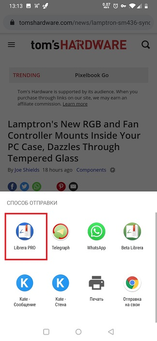

# Comment transférer du texte à partir du navigateur Web (à lire ou TTS)

> Dans Librera, vous pouvez lire des articles à partir du navigateur Internet à la fois par texte et par reproduction sexuelle.

 
Pour lire à Librera, il vous faut:

* Ouvrez la page Web dont vous avez besoin dans votre navigateur. Pour cet exemple, le navigateur omehrome sera utilisé. Vous pouvez utiliser votre navigateur avec la possibilité de partager la page à partir du navigateur.

* Cliquez sur l'icône de partage dans votre navigateur Internet.

* Sélectionnez Librera dans la liste déroulante des programmes.

* Sélection du mode de lecture souhaité Vous souhaitez afficher le texte transmis à partir du navigateur. En cochant la case &quot;Mémoriser la sélection&quot;, tous les textes ultérieurs transférés à partir du navigateur s'ouvrent selon le type de lecture choisi.

||||
|-|-|-|
||||

Maintenant, le texte du navigateur s'ouvre dans Librera. Pour faciliter la lecture, vous pouvez ajouter des traits d'union au texte en sélectionnant la langue de ceux-ci.

||||
|-|-|-|
||||

Vous pouvez jouer le texte à la voix. Pour lire du texte par la voix, le synthétiseur de voix installé sur le système Android est utilisé.
Vous n'avez pas encore établi ce que vous pouvez utiliser sur Google Play: la synthèse vocale Google.

* Cliquez sur l'icône de lecture vocale.

* Vérifiez si le synthétiseur vocal est installé et dans la langue de lecture souhaitée

* Appuyez sur Play, écoutez le texte.

Si vous fermez la fenêtre de configuration lorsque vous lisez du texte en parole, les boutons de commande sont dupliqués par le sous-texte et dans le rideau de notification, pour faciliter la gestion. Pour arrêter de lire, appuyez sur pause et traversez.

||||
|-|-|-|
||||
