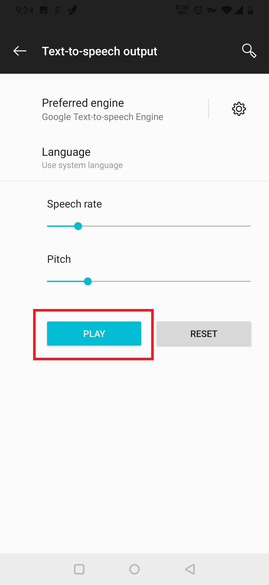

# تثبيت وتهيئة تحويل النص إلى كلام (TTS)

> Librera يسمح لك بالتعبير عن نص مستنداتك عن طريق المزج الصوتي لجهة خارجية المثبتة في نظام أندرويد. تحويل النص إلى كلام (TTS)

## لتثبيت أداة النطق الصوتية (TTS). استخدام مثال تحويل النص إلى كلام من Google.

* انقر على أيقونة &quot;التشغيل الصوتي للنص&quot;
* في إعدادات TTS ، حدد أيقونة **&quot;i&quot;**
* حدد أداة مزج الصوت من Google Text-to-Speech من القائمة المنسدلة. سوف تذهب إلى Google Market ، في قسم تثبيت أداة توليف الصوت. انقر فوق &quot;تثبيت&quot; Google Voice-to-Speech synthesizer
* بعد التثبيت ، ارجع إلى إعدادات TTS Librera.

||||
|-|-|-|
||||

## لإعداد Google Text-to-Speech:

* انقر على رابط &quot;الصوت&quot;. سيتم نقلك إلى إعدادات تحويل النص إلى كلام من Google
* انقر على أيقونة إعدادات تحويل النص إلى كلام من Google
* حدد &quot;تثبيت البيانات الصوتية&quot; - اضبط لغة المزج الصوتي
* حدد لغة المزج الصوتي التي تحتاجها. يمكنك عرض اللغات عن طريق الضرب لأعلى أو لأسفل
* اختر نوع الصوت الذي تحتاجه ، وفقًا لتفضيلاتك.

بعد تحديد جميع الخيارات ، انقر في شريط التنقل &quot;للخلف&quot; ، ثم عد إلى إعدادات تحويل النص إلى كلام من Google ، وانقر فوق &quot;تشغيل&quot;. سيتم اختبار تحية اختبار Google Voice synthesizer باللغة والصوت الذي تختاره. انتقل إلى Librera ، واضغط على أيقونة &quot;قراءة صوتية للنص&quot; ، وانقر على &quot;Play&quot; واستمع إلى كتابك.

||||
|-|-|-|
||||

||||
|-|-|-|
||||
