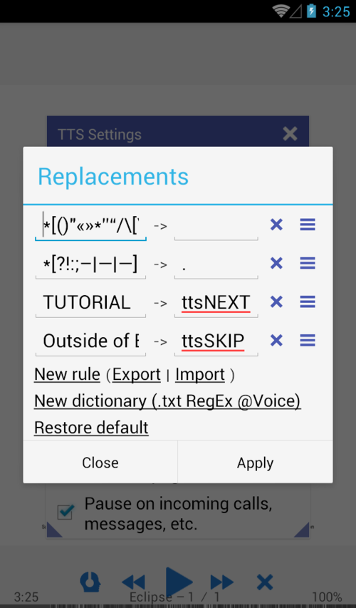

# Remplacements TTS

> Les substitutions de synthèse vocale servent à modifier la façon dont le moteur prononce certains mots, à ignorer certains caractères lors de la lecture ou à définir des marques de contrainte correctes.

* Activer les remplacements TTS
* Afficher le passage avec les résultats de remplacement
* La boîte de dialogue **Remplacements** pour la définition des règles de remplacement

|1|2|3|
|-|-|-|
||||

Les remplacements classiques sont pris en charge (changement simple d'une chaîne pour une autre), ou vous pouvez utiliser des expressions régulières (RegExp).

## expressions

* &quot;texte&quot; - Texte simple
* &quot;* text&quot; - * règle RexExp
* &quot;# text&quot; - règle désactivée
* &quot;text256&quot; - règle désactivée

## Exemples

* &quot;Lib.&quot; -&gt; &quot;Librera&quot; - remplace Lib. avec Librera
* &quot;Librera&quot; -&gt; &quot;Libréra&quot; - ajoute une marque de contrainte correcte
* &quot;# Lib.&quot; -&gt; &quot;Librera&quot; - utilisez &quot;#&quot; pour désactiver une règle
* &quot;* (L | l) ib.&quot; -&gt; &quot;$ 1ibrera&quot; - remplace Lib. avec Librera et lib. avec librera
* &quot;* [()&quot; «» * &quot;&quot;/[] &quot;-&gt;&quot; &quot;- Ignorer les caractères
* &quot;* [?!:; - - | - | -]&quot; -&gt; &quot;,&quot; - remplace les caractères par une pause (,)

## Ajouter un fichier de règles

**Librera** prend en charge les fichiers de règles RegExp de **@ Voice Reader**.
Découvrez cet exemple **demo-replaces.txt** ci-dessous:

```
" живого " "живо́ва"
" как глаза " " как глаза́ "
" мне глаза" " мне глаза́"
" наклоняющая головы" "наклоня́ющая го́ловы"
" никакого стрелка" "никако́во стрелка́"
" ПОЖАРОБЕЗОПАСНУЮ СРЕДУ" "пожарабезопа́сную среду́."
" Стрелки!" "Стрелки́!"
" стрелки?" "стрелки́?"
", все так," ", всё так,"
"Зачем, стрелок?" "Зачем, стрело́к?"
"стрелок?" "стрело́к?"
*"(?i)\b\Q душа в душу\E\b" "душа́ в ду́шу"
*"(?i)\b\Q подогнулись\E\b" "падагну́лись"
*"(?i)\b\Q стрелки почувствовали\E\b" "стрелки́ почувствовали"
*"(?i)\b\Q стрелки продолжили\E\b" "стрелки́ продолжили"
*"(?i)\b\Q стрелку из\E\b" "стрелку́ из"
*"(?i)\b\Q стрелок\E\b" "стрело́к"
*"(?i)\b\Q стрелы\E\b" "стре́лы"
*"(?i)\b\Q*\E\b" "сно́ска"
*"(?i)\b\Q1 курса\E\b" "1-го курса"
*"(?i)\b\Q171 группы\E\b" "171-ой группы"
*"(?i)\b\Q1977\E\b" "1977-ой"
*"(?i)\b\QAcapela\E\b" "Акапэ́'ла"
*"(?i)\b\QBIOS\E\b" "БИ́“О́С"

*"(^| )(Д|д)-р" " доктор"
"(^| )(Г|г)-н" " господин"
*"(\d+)\s?-\s?я\b(?# ""я"" на границе слова)" "$1-я "
```
## Ignorer les zones cultivées dans les documents PDF
> Très souvent, les pages de fichiers PDF (livres, articles de journaux, manuels, etc.) ont des en-têtes et des pieds de page qui couvrent l’ensemble du document. Vous pouvez rogner les têtes qui courent par pincement à deux doigts, ce qui permet de passer aux pages suivantes (et précédentes). Mais votre moteur TTS n'a aucune idée de vos manipulations. Donc, vous devez lui dire quoi faire (Passer la chose ennuyante!) Tout en lisant le document à voix haute.

Dans **Librera**, nous avons introduit des remplacements spéciaux (commandes) qui vous permettent d'ignorer les zones recadrées et d'assurer une lecture continue et ininterrompue.
* Dans la fenêtre **Remplacements**, entrez un mot ou une séquence de mots dans la colonne de gauche et remplacez _ttsSKIP_. Ce remplacement indiquera au moteur de sauter la phrase avec ce mot/cette séquence de mots
* Entrez un mot ou une séquence de mots dans la colonne de gauche et remplacez _ttsNEXT_. Le remplaçant dira au moteur de sauter la phrase avec ce mot/séquence de mots et d'aller immédiatement à la page suivante
* N'oubliez pas d'appuyer sur _APPLY_ pour laisser les remplacements en attente

|4|5|
|-|-|
|||

> **Testez vos modifications plusieurs fois pour vous assurer que tout fonctionne comme il se doit!**
