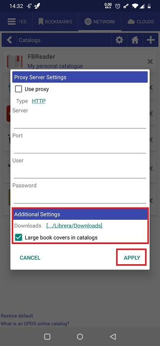

# Utilisation des catalogues en ligne OPDS

> Librera prend en charge le travail avec les catalogues en ligne OPDS, ce qui vous permet de connecter les bibliothèques nécessaires et de télécharger des livres.

## Pour ajouter le répertoire en ligne nécessaire OPDS, vous avez besoin des éléments suivants:
* Accédez à l'onglet &quot;Réseau&quot;.
* Appuyez sur l'icône pour ajouter un répertoire. Prenons l'exemple de l'ajout du répertoire de la bibliothèque OPDS &quot;Project Gutenberg&quot;
* Entrez l'adresse Internet du répertoire ops.
* Appuyez sur &quot;Ajouter&quot;.
* Bibliothèque OPDS ajoutée

Pour remettre les paramètres OPDS/Library à leur état initial, cliquez sur le bouton &quot;Restaurer les paramètres par défaut&quot; en bas à gauche de la fenêtre.

Si vous voulez savoir quels sont les catalogues OPDS, cliquez sur le lien &quot;Qu'est-ce qu'un catalogues en ligne OPDS&quot; en bas à gauche de la fenêtre.

||||
|-|-|-|
||||

||||
|-|-|-|
||||

## Pour télécharger un livre du catalogue OPDS, vous avez besoin des éléments suivants:
* Sélectionnez le livre dont vous avez besoin.
* Sélectionnez le format de livre souhaité, appuyez dessus.
* Confirmez le téléchargement du livre.
* Une fois le livre téléchargé, le surlignage en couleur apparaît. Cliquez dessus.
* Bonne lecture.

||||
|-|-|-|
||||

## Vous pouvez ajouter des liens du répertoire OPDS à vos favoris:
* Accédez au livre dont vous avez besoin dans le répertoire OPDS.
* Appuyez sur l'icône des favoris
* Confirmer l'ajout
* Un répertoire contenant vos liens sera ajouté à la fenêtre principale des bibliothèques OPDS.

||||
|-|-|-|
||||

## Configuration générale des répertoires OPDS:
* appuyez sur l'icône des paramètres
* Vous pouvez configurer un proxy pour se connecter à OPDS
* Vous pouvez spécifier le répertoire dans lequel vos livres téléchargés seront enregistrés.

||||
|-|-|-|
||||

